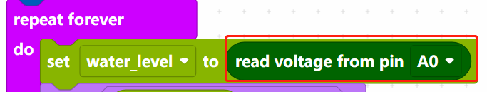
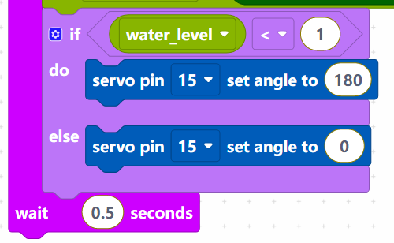

.. _per_smart_water_tank:

2.8 Intelligent Water Level Monitor
===================================

This project creates an automated water level monitoring system utilizing ultrasonic distance measurement technology to detect liquid levels and provide visual feedback through an LED bar graph display.

Ultrasonic sensors employ high-frequency sound waves for non-contact distance measurement. The device features four connection terminals: VCC (power input), GND (ground reference), Trig (trigger signal), and Echo (response signal).

.. image:: img/Smart_Water_Tank_ultrasonic_pic.png

Required Components
^^^^^^^^^^^^^^^^^^^
- Raspberry Pi Pico W x1
- MicroUSB cable x1
- 830 Tie-Points Breadboard x1
- Ultrasonic Sensor x1
- LED Bar Graph x1
- Resistor 220Ω x10
- Jumper Wire Several
  

Circuit Assembly
^^^^^^^^^^^^^^^^

.. image:: img/Smart_Water_Tank_Wiring.png

* Ultrasonic sensor interfaces with GPIO pins GP14 (trigger output) and GP15 (echo input).
* LED bar graph elements connect to digital output pins GP13 through GP22.

Programming Implementation
^^^^^^^^^^^^^^^^^^^^^^^^^^

.. note::

    * Utilize the visual programming interface shown below through drag-and-drop methodology. 
    * Import ``2.8_Smart_Water_Tank.png`` from the location ``Ultimate-Starter-Kit-for-Pico-W\Piper_Make``. For complete instructions, reference :ref:`import_code_piper`.

.. image:: img/Smart_Water_Tank_Code.png

Following Pico W connection, activate the **Start** button to initiate program execution. Position your hand above the ultrasonic sensor to observe corresponding variations in the LED bar graph illumination pattern.

How it Works?
^^^^^^^^^^^^^^^^^^^^^^^^

Set the rotation speed of pin15 (servo) to 15%.

* [servo pin() set speed to ()%]: Used to set the rotation speed of the servo pin, the range is 0%~100%.

Reads the value of pin A0 and stores it in the variable [water_level].

* [set (water_level) to]: Used to set the value of the variable, you need to create the variable from the **Variables** palette.
* [read voltage from pin ()]: Used to read the voltage of the analog pins (A0~A2), the range is 0 ~ 3.3V.

Set the voltage threshold to 1. When the voltage of water level sensor is less than 1, let the servo rotate to 180° position, otherwise rotate to 0° position.

* [servo pin () set angle to ()]: Set the angle of servo pin to, the range is 0 ~ 180°.

