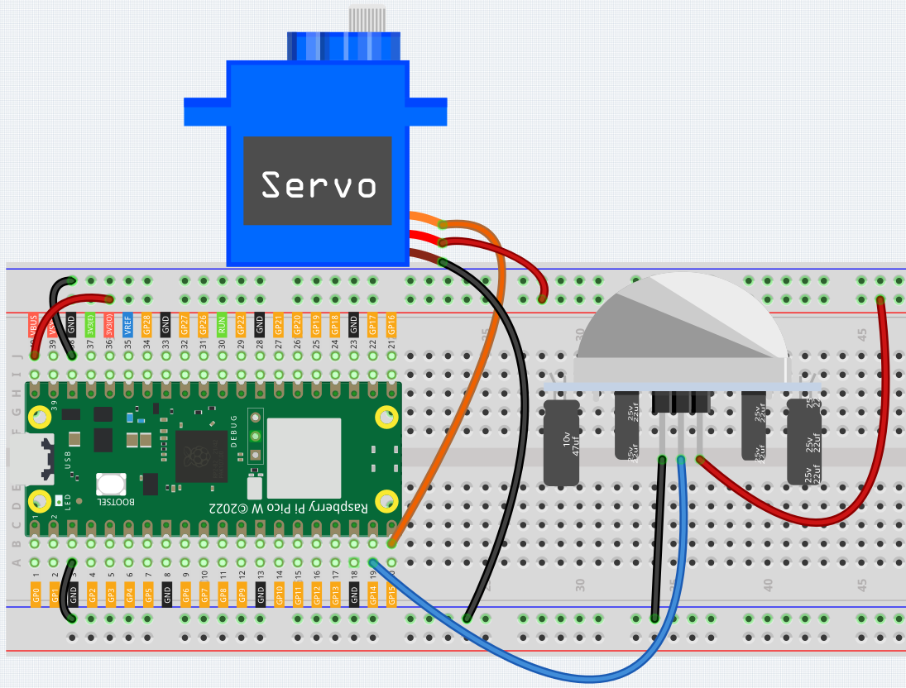
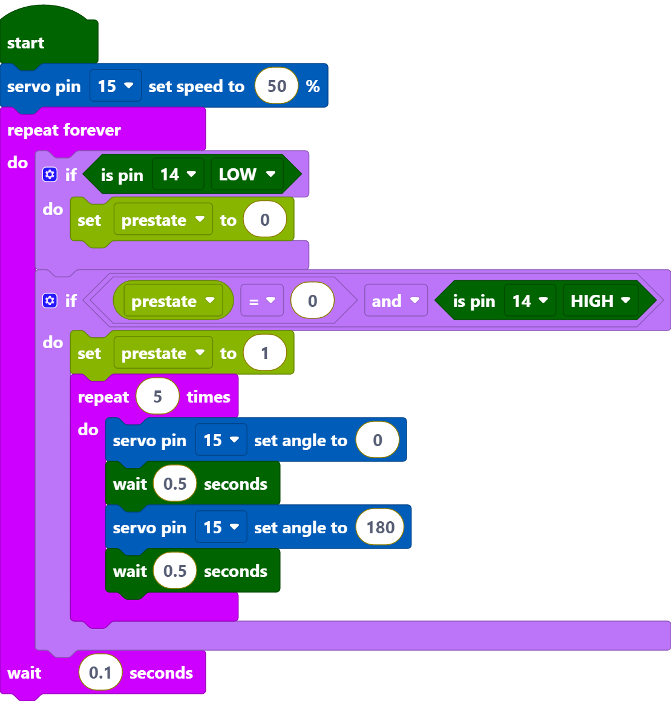
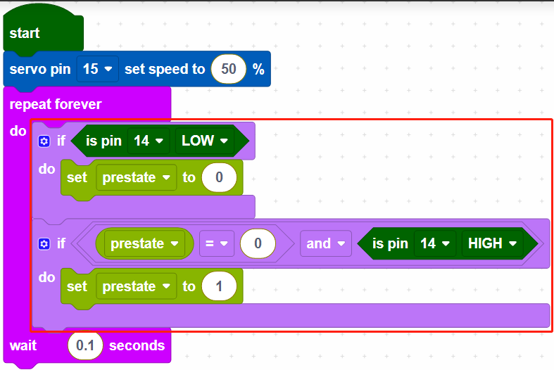
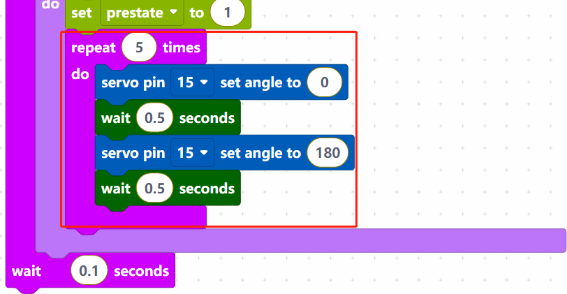

.. _per_lucky_cat:

2.9 Pets Welcome
==========================

In this project, we use pir and servo to make a lucky pet. The PIR Module is used to detect the visitors and servo is used to imitate the beckoning motion of the lucky cat.

Component List
^^^^^^^^^^^^^^^^^^^^^^^^
- Raspberry Pi Pico W x1
- MicroUSB cable x1
- 830 Tie-Points Breadboard x1
- Servo x1
- PIR Motion Sensor Module x1
- Jumper Wire Several

Wiring
^^^^^^^^^^^^^^^^^^^^^^^^

* The orange wire (signal) of the servo is connected to GP15, the red wire (power) is connected to VBUS, and the brown wire (ground) is connected to GND. 
* The middle pin of the PIR module is connected to the GP3.

Code
^^^^^^^^^^^^^^^^^^^^^^^^

.. note::

    * You can refer to the image below to write code by dragging and dropping. 
    * Import ``2.9_Pets_Welcome.png`` from the path of ``Ultimate-Starter-Kit-for-Pico-W\Piper_Make``. For detailed tutorials, please refer to :ref:`import_code_piper`.

* After connecting Pico W, click the **Start** button and the code starts to run.
* When the PIR module detects a customer arrival, the servo oscillates back and forth five times and then stops.

How it Works?
^^^^^^^^^^^^^^^^^^^^^^^^

Set the rotation speed of pin15 (servo) to 15%.

If GP14 is low, set the variable [prestate] to 0. When the variable [prestate] is 0 and GP14 is high (human detected), set the variable [prestate] to 1.

The purpose of this is to make the main code work only when the GP14 changes from low to high, and to respond only once if the PIR module keeps detecting people.

Make the servo cycle 5 times from 0 to 180 degrees rotation.

* [repeat () times do]: Loop through the code inside the do block a finite number of times.

