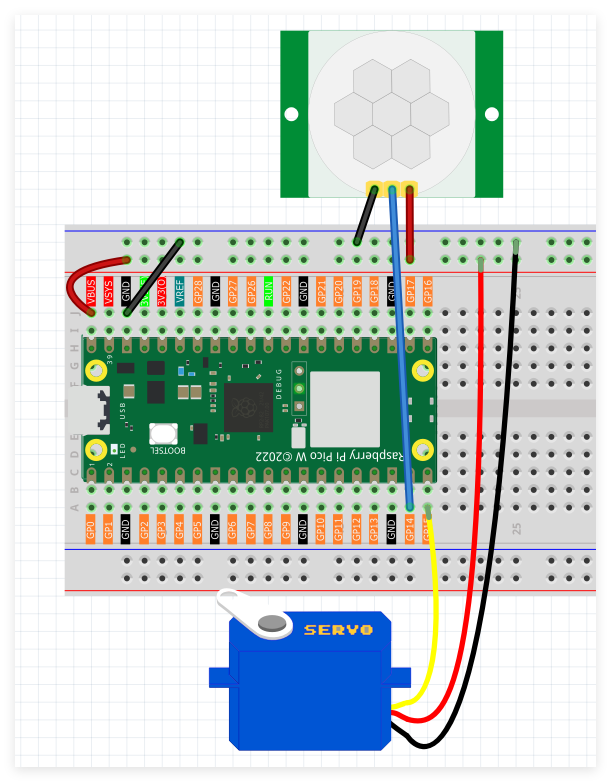
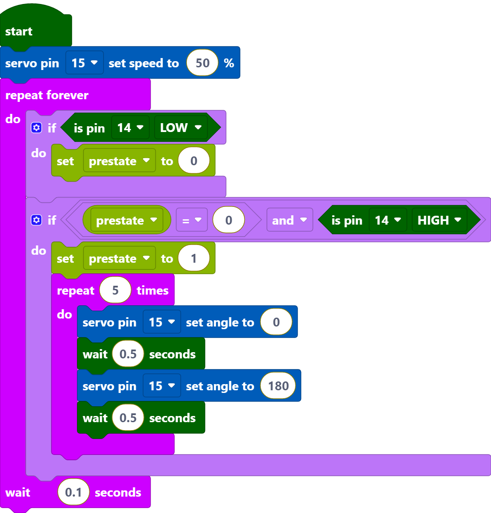
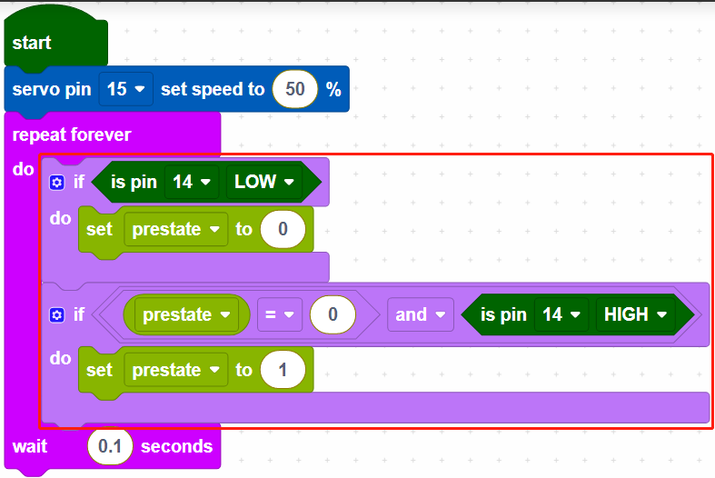
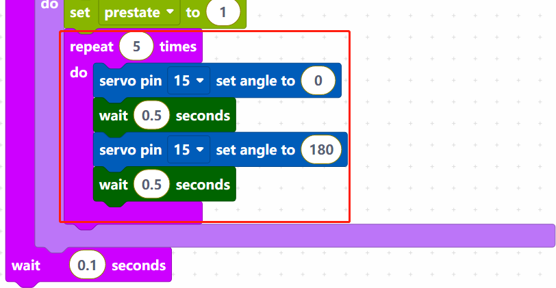

.. _per_pets_welcome:

2.9 Animal Motion Detection System
==================================

In this project, we use pir and servo to make a lucky pet. The PIR Module is used to detect the visitors and servo is used to imitate the beckoning motion of the lucky cat.

Component List
^^^^^^^^^^^^^^^^^^^^^^^^
- Raspberry Pi Pico W x1
- MicroUSB cable x1
- 830 Tie-Points Breadboard x1
- Servo x1
- PIR Motion Sensor Module x1
- Jumper Wire Several
  

Circuit Configuration
^^^^^^^^^^^^^^^^^^^^^

* PIR motion sensor interfaces with digital input pin GP14.
* Active buzzer connects to digital output pin GP13.

Programming Implementation
^^^^^^^^^^^^^^^^^^^^^^^^^^

.. note::

    * Follow the visual programming guide below using drag-and-drop techniques. 
    * Load ``2.9_Pets_Welcome.png`` from the directory ``Ultimate-Starter-Kit-for-Pico-W\Piper_Make``. For comprehensive guidance, see :ref:`import_code_piper`.

Upon Pico W connection, press the **Start** button to begin program execution. Move your hand within the PIR sensor's detection range to activate the welcoming audio response.

How it Works?
^^^^^^^^^^^^^^^^^^^^^^^^

Set the rotation speed of pin15 (servo) to 15%.

If GP14 is low, set the variable [prestate] to 0. When the variable [prestate] is 0 and GP14 is high (human detected), set the variable [prestate] to 1.

The purpose of this is to make the main code work only when the GP14 changes from low to high, and to respond only once if the PIR module keeps detecting people.

Make the servo cycle 5 times from 0 to 180 degrees rotation.

* [repeat () times do]: Loop through the code inside the do block a finite number of times.

