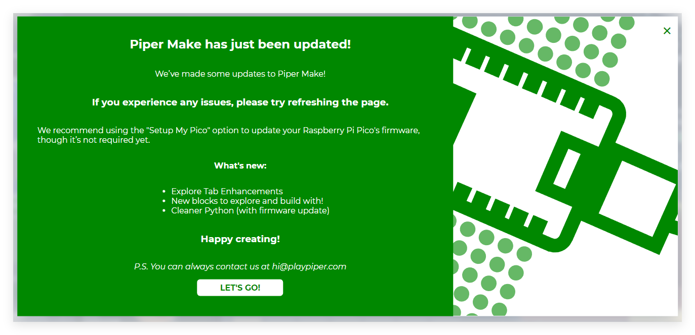
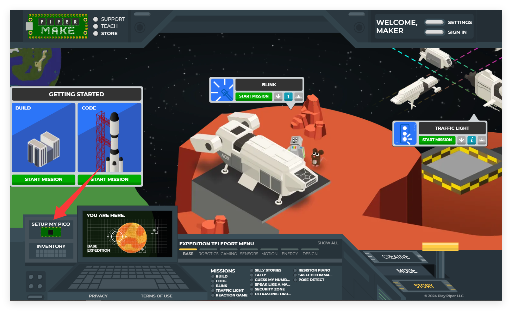
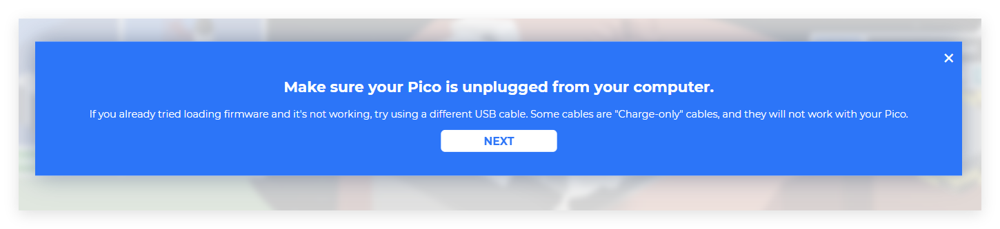
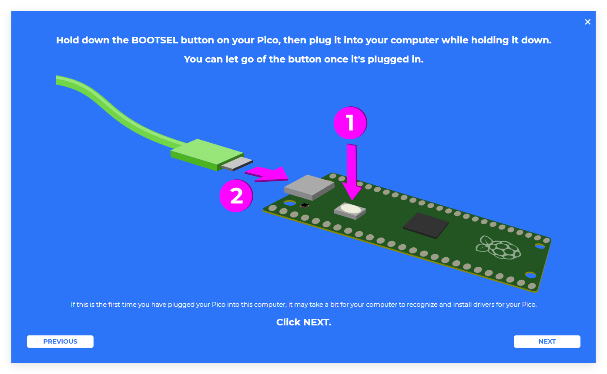
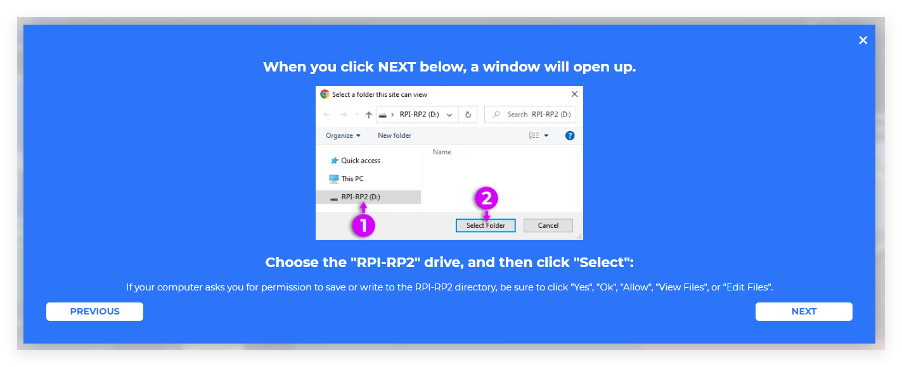
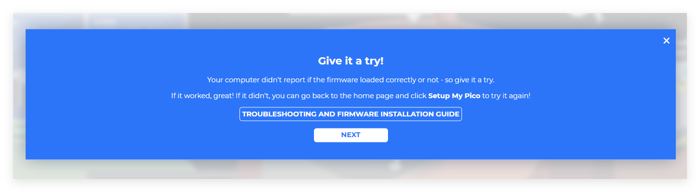

.. _per_setup_pico:

1.1 Initializing Your Pico Board
=================================

Begin by navigating to the Piper Make platform using this URL: 
`Piper Make <https://make.playpiper.com/>`_

When the welcome dialog appears, you may proceed by clicking **Let's Go!** or simply close it using the **x** icon if you prefer to skip the subscription options.

.. note::
    Should you encounter a different dialog window, this indicates browser compatibility issues. Please upgrade your browser to the latest version and retry.

Locate the **SETUP MY PICO** option and select it to begin the configuration process.

Proceed by clicking **Next** to initiate the Pico W setup procedure. This process applies whether you're configuring the device for the first time or updating existing firmware.

At this stage, ensure your Pico W is disconnected from the computer, as the following step requires a specific connection method. Verify that your micro USB cable supports both power delivery and data transfer, as some cables are power-only.

While holding down the **RST** (white) button on your Pico W, connect the device to your computer. Release the button only after the connection is established.

The Pico W will now be recognized as a removable storage device. Click **Next** and then choose the **RPI-RP2** drive from the available options.

.. note::
    Upon selecting the **RPI-RP2** drive, your browser will display a permission request at the top of the page. Grant access to allow file system interaction.

Piper Make will now begin transferring firmware to your Pico W. You'll need to authorize write permissions to the storage device when prompted.

The appearance of this confirmation message indicates successful setup completion, and your Pico W is ready for use.

.. note::
    `Experiencing firmware installation issues? <https://make.playpiper.com/assets/documents/Piper%20Make%20Troubleshooting%20Guide.pdf>`_