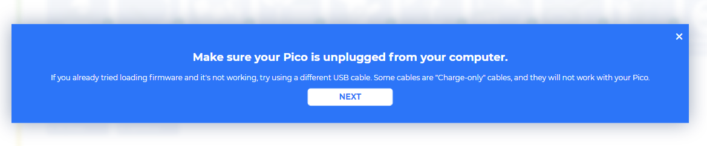

.. _per_setup_pico:

1.1 Set up the Pico
=====================

First, visit Piper Make through the following link: 
`Piper Make <https://make.playpiper.com/>`_

In the pop-up page, if you don't need to subscribe for more tutorials, you can just click **Let's Go!** or the **x** button.

.. image:: ../img/setup_pipermake1.png

.. note::
    If you see a different pop-up window, your browser version is not supported, please update your browser and try again.

Find the **SETUP MY PICO** button, click it, and follow the prompts to configure it.

Click **Next** to start configuring your Pico W, even if you have set it up before, these are the same steps you will use to update your Pico W firmware.

In this step, you need to make sure that your Pico W is unplugged from your computer, as it needs to be plugged in in a specific way in the next step. Make sure your cable can handle power and data, as many micro USB cables only have power.

Now, press and hold the **RST** (white) button on the Pico W and plug the Pico W into your computer. Once plugged in, you can release the button.

.. image:: ../img/setup_pipermake5.png

Your Pico W will appear as a USB drive, click **Next** after that select **RPI-RP2** drive.

.. note::
    After selecting the **RPI-RP2** drive, there will be a pop-up window at the top that you need to allow the web page to view files.

.. image:: ../img/setup_pipermake6.png

Now Piper Make will load the firmware to your Pico W, again you need to allow save changes to the hard drive where the Pico W is located.

When this prompt appears, it means your Pico W is set up and you can start using it.

.. image:: ../img/setup_pipermake8.png

.. note::
    `Have a question about burn firmware? <https://make.playpiper.com/assets/documents/Piper%20Make%20Troubleshooting%20Guide.pdf>`_