.. _quick_guide_piper:

1.2 Comprehensive Piper Make Walkthrough
=========================================

1. Building Your First Project
-------------------------------

With your Pico W properly configured, we can now explore programming fundamentals. 
Let's begin by illuminating the built-in LED.

Navigate to ``CREATIVE MODE`` and select the **New Project** option. 
A fresh project will be generated in the **MY PROJECTS** area with 
an automatically assigned name that you can modify later within the development environment.

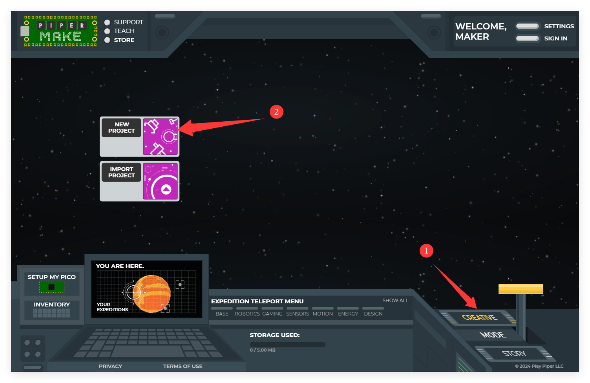

Launch the newly created project by clicking on it.

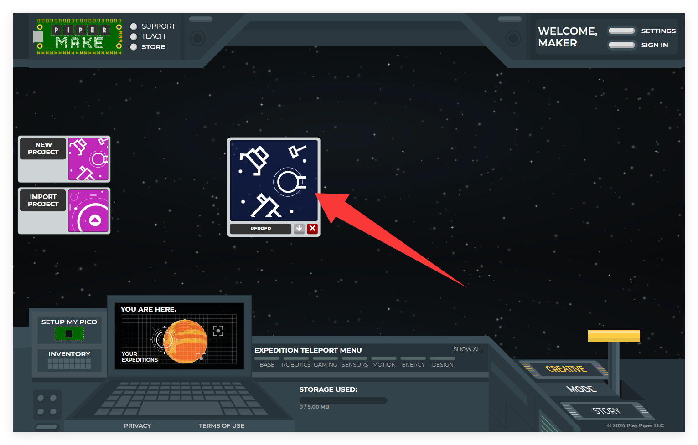

You'll now enter the Piper Make development interface.

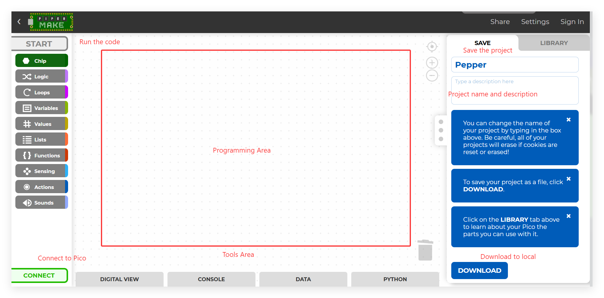

* **START**: Executes your program. When grayed out, it indicates no active Pico W connection.
* **Block palette**: Houses various programming block categories.
* **CONNECT**: Establishes Pico W communication. Displays green when disconnected, changes to red **DISCONNECT** when linked.
* **Programming Area**: The workspace where you assemble your program by combining blocks.
* **Tools Area**: Access **DIGITAL VIEW** for pin layout reference; monitor output via **CONSOLE**; examine sensor readings in **DATA**; review generated **Python** code.
* **Project name and description**: Customize your project's title and details.
* **DOWNLOAD**: Export your project locally in **|** format for future import using the **Import Project** feature on the homepage.

From the **Chip** palette, select and drag the [start] block into the **Programming Area**.

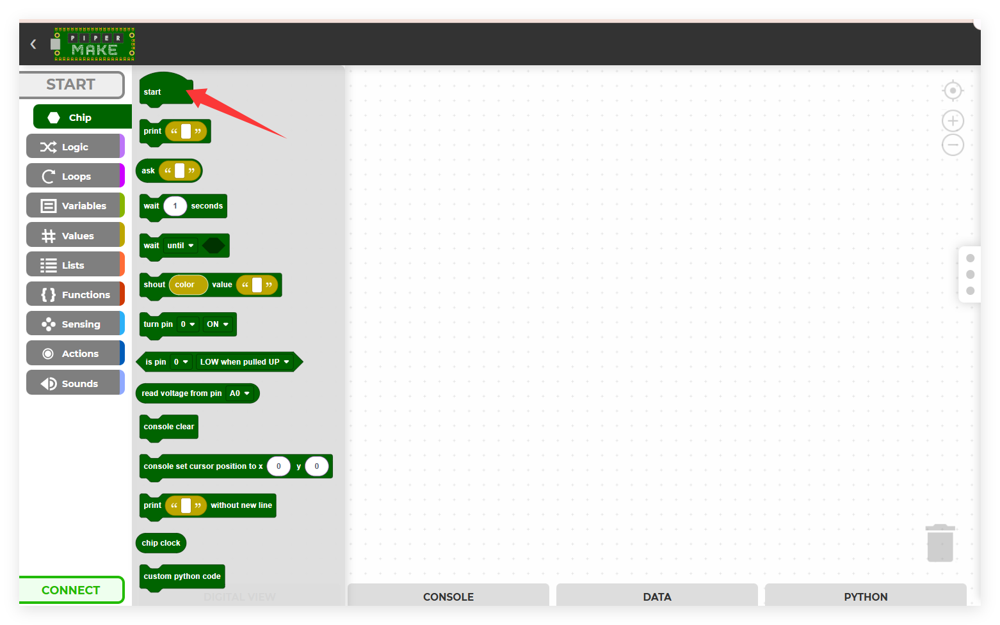

Next, retrieve the [loop] block from the **loops** palette and attach it beneath the [start] block, configuring the cycle duration to 1 second.

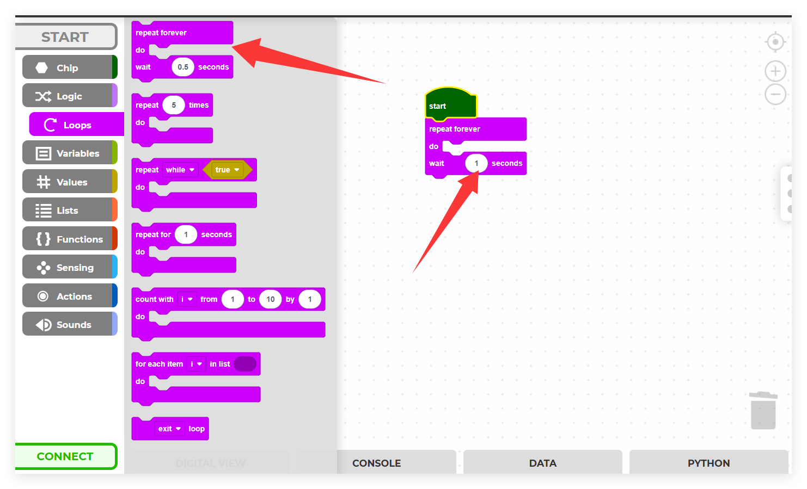

Since the Raspberry Pi Pico's integrated LED connects to pin25, we'll employ the [turn pin () ON/OFF] block from the **Chip** palette for control.

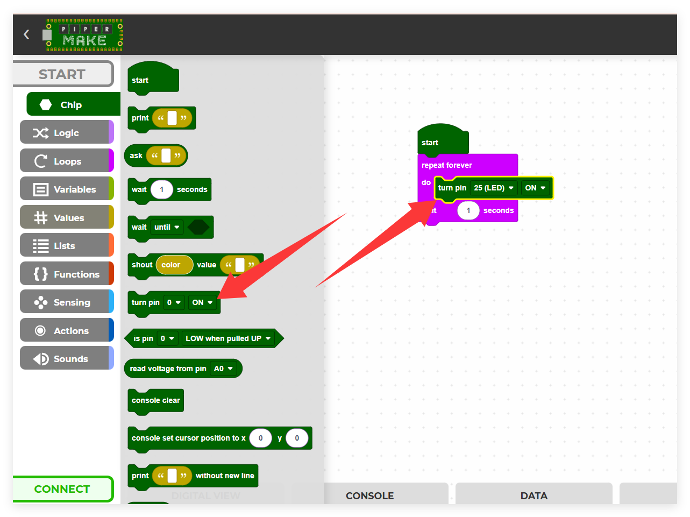

.. _connect_pico_per:

2. Establishing Pico W Connection
---------------------------------

Select the **CONNECT** button to establish communication with your Pico W. This action will trigger a connection dialog.

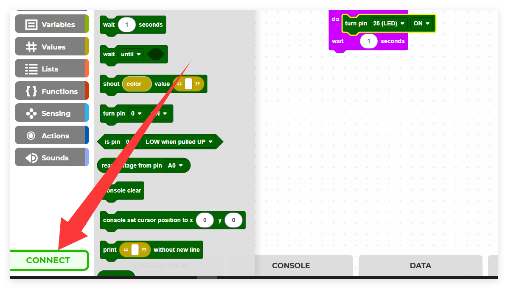

Choose the detected **CircuitPython CDC control (COMXX)** port from the list, then proceed by clicking **Connect**. 

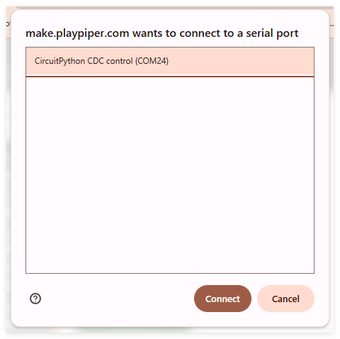

Upon successful connection, the green **CONNECT** indicator in the lower-left will transform into a red **DISCONNECT** button.

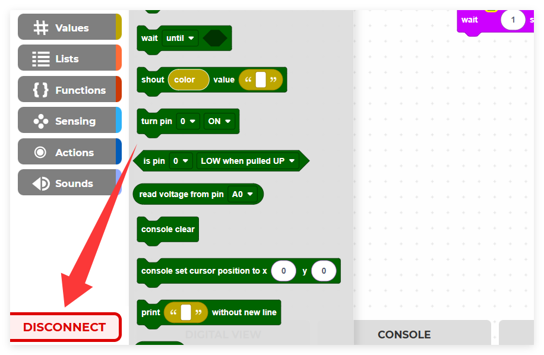

3. Executing Your Program
-------------------------

Press the **START** button to execute your code, which will illuminate the Pico W's LED. If the button appears grayed out, verify your Pico W connection and re-establish if necessary.

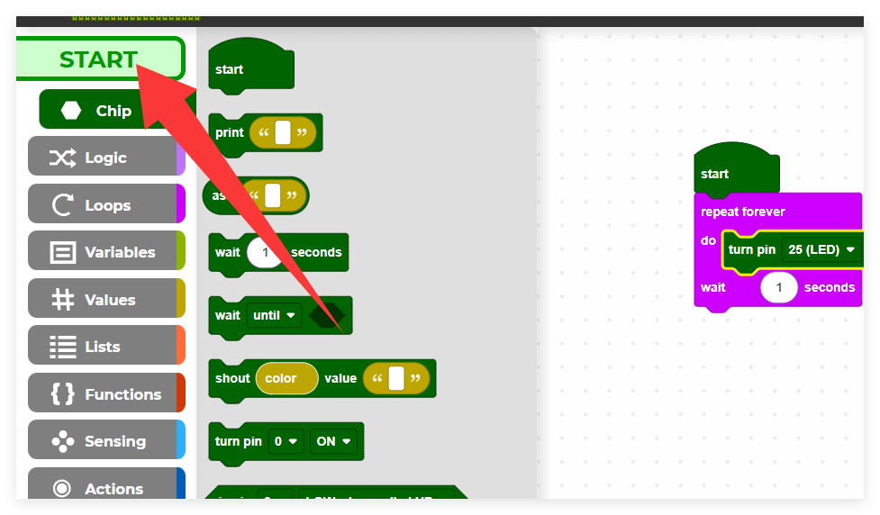

To create a blinking effect, add a block to deactivate pin25 within the loop cycle, then click **START** again to observe the LED flashing pattern.

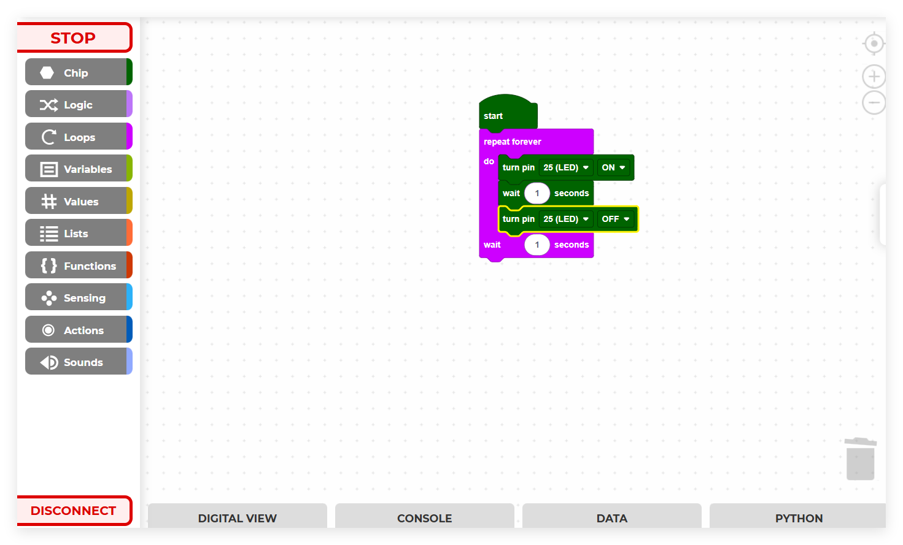
