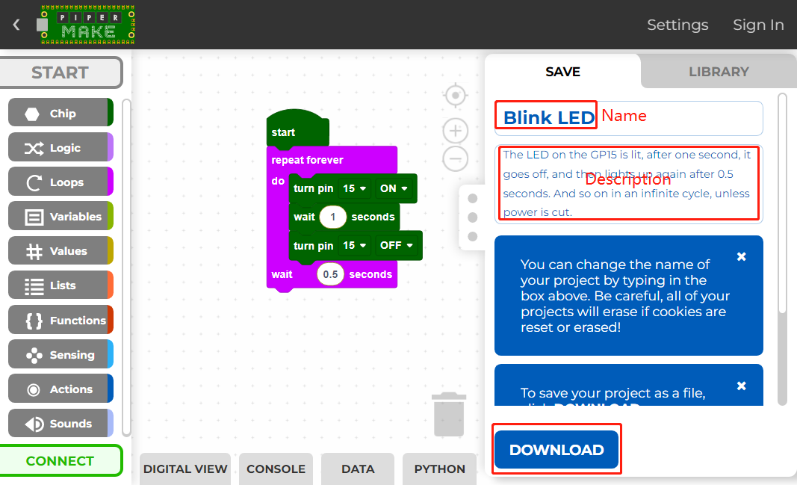
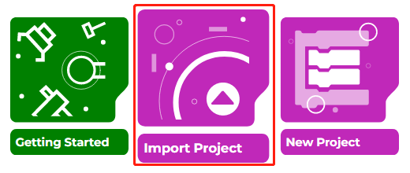
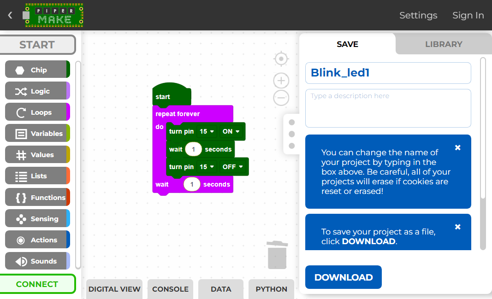

.. _per_save_import:

1.3 Saving and Importing Code Projects
=========================================

Save the Code
--------------------

After writing the code, you can change the code name and description, and then click the **Download** button to save the code locally or share it with others.

Then enter the file name and click the **Download** button again to save the code as a ``.png`` file.

.. _import_code_piper:

Import the Code
--------------------

In Piper Make's `home page <https://make.playpiper.com/>`_, click **Import Project**.

Select the ``.png`` file in the path ``Ultimate-Starter-Kit-for-Pico-W\Piper_Make`` and click **Import**. 
Note that you need to download the `Ultimate-Starter-Kit-for-Pico-W <https://github.com/lafvintech/Ultimate-Starter-Kit-for-Pico-W/archive/refs/heads/main.zip>`_ package first.
Or check out the code at `Ultimate-Starter-Kit-for-Pico-W - GitHub <https://github.com/lafvintech/Ultimate-Starter-Kit-for-Pico-W>`_.

Now you can see the file you imported.

