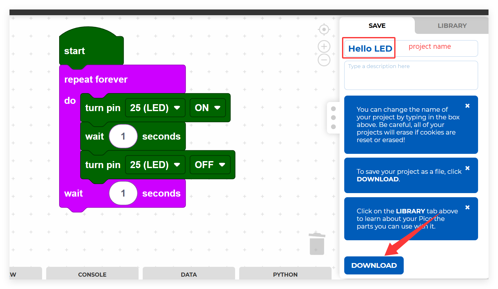
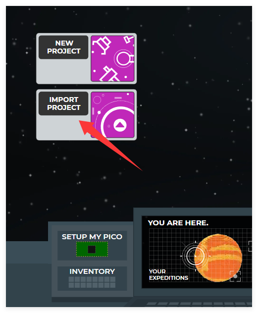
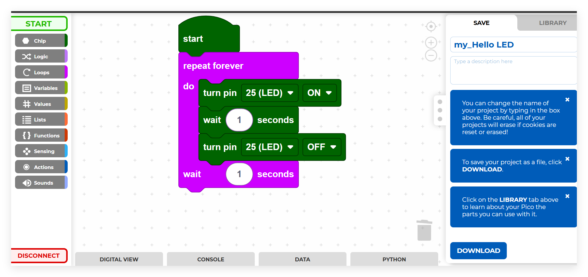

.. _per_save_import:

1.3 Project Export and Import Operations
=========================================

Exporting Your Project
-----------------------

Once you've completed your programming work, modify the project title and description as needed, then select the **Download** option to export your project for local storage or distribution.

Specify your desired filename and click the **Download** button once more to export your project as a ``.png`` file format.

.. _import_code_piper:

Loading Existing Projects
--------------------------

From the Piper Make `main interface <https://make.playpiper.com/>`_, select **Import Project**.

Browse to locate the ``.png`` file within the ``Ultimate-Starter-Kit-for-Pico-W\Piper_Make`` directory and proceed with **Import**. 
Ensure you have first obtained the `Ultimate-Starter-Kit-for-Pico-W <https://github.com/lafvintech/Ultimate-Starter-Kit-for-Pico-W/archive/refs/heads/main.zip>`_ package.
Alternatively, access the repository directly at `Ultimate-Starter-Kit-for-Pico-W - GitHub <https://github.com/lafvintech/Ultimate-Starter-Kit-for-Pico-W>`_.

Your imported project will now be visible and accessible within your workspace.

