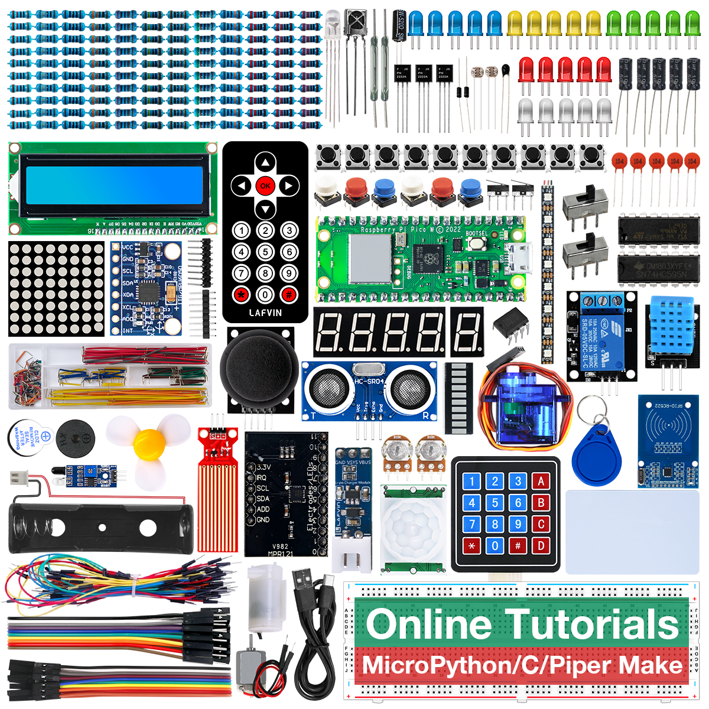

About This Kit
===============

LAFVIN Ultimate Starter Kit for Pico W
---------------------------------------

Introduction
-------------
The LAFVIN Ultimate Starter Kit for Pico W uses the powerful Raspberry Pi Pico W as its core controller and integrates wireless functionality. This kit provides you with a comprehensive learning and development platform, allowing you to easily master the powerful features of the Raspberry Pi Pico W.
The kit offers rich learning resources, including multiple project examples written in C, MicroPython, and Piper Make. Each project comes with detailed circuit diagrams and verified code to help you quickly understand and practice.
We provide online web tutorials that you can access and refer to anytime, anywhere. Additionally, our free technical support team is always available to answer your questions, ensuring a smooth learning and development process.

Features
----------
1. Controller: Raspberry Pi Pico W
2. Programming Languages: Supports both MicroPython C++ and Piper make, catering to different programming preferences
3. Wireless Functionality: Supports WiFi and Bluetooth connections, facilitating remote control and data transmission
4. Rich Project Examples: Includes multiple project examples in C MicroPython and Piper make, comprehensively showcasing the application potential of Raspberry Pi Pico
5. Online Tutorials: Web-based tutorials accessible anytime, convenient for learning and reference
6. Technical Support: Provides free technical support to answer your questions and assist in problem-solving