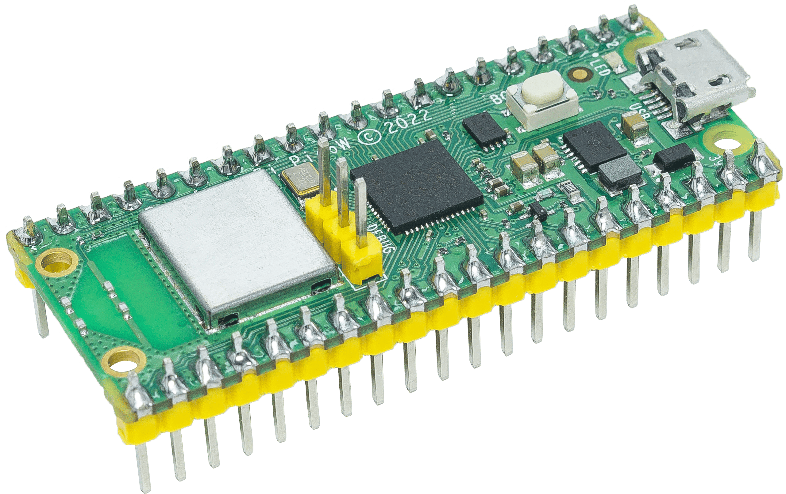
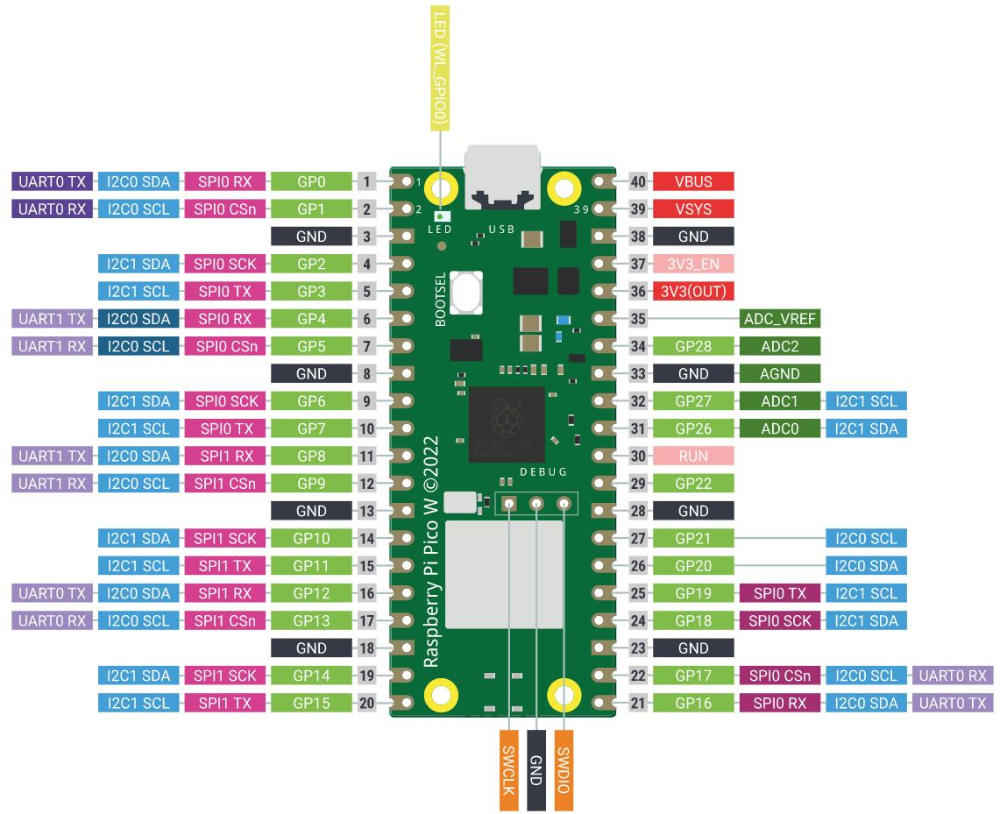

Notes for GPIO
==================

GPIO Overview
---------------
The Raspberry Pi Pico W has 26 multi-function GPIO pins (GP0 to GP28, with some numbers not used). 
All GPIO pins can be assigned various functions, including digital input, digital output, 
and up to 8 different alternate functions such as UART, I2C, SPI, PWM, etc.

By default, all GPIO pins are configured as digital inputs with pull-down enabled 
when the Pico W powers up or resets.

.. note::
    GPIO pins on the Pico W operate at 3.3V. They are NOT 5V tolerant, and 
    connecting them to 5V may damage your board.

Special Function Pins
-------------------------
Some GPIO pins have special default functions on the Pico W:

* **LED Pin**: GP25 is connected to the onboard LED
* **UART0**: GP0 (TX) and GP1 (RX) are the default UART pins
* **I2C0**: GP4 (SDA) and GP5 (SCL) are the default I2C pins
* **SPI0**: GP16-19 are used for the onboard wireless chip (CYW43439)
* **USB**: GP24 (D-) and GP25 (D+) are used for USB communication

For detailed information about GPIO functionality, please refer to the official 
Raspberry Pi Pico W Technical Documentation: `<https://www.raspberrypi.com/documentation/microcontrollers/pico-series.html#picow-technical-specification>`_

Or you can click on the links below: 

* `Raspberry Pi Pico W product brief <https://datasheets.raspberrypi.com/picow/pico-w-product-brief.pdf>`_
* `Raspberry Pi Pico W datasheet <https://datasheets.raspberrypi.com/picow/pico-w-datasheet.pdf>`_
* `Getting started with Raspberry Pi Pico: C/C++ development <https://datasheets.raspberrypi.org/pico/getting-started-with-pico.pdf>`_
* `Raspberry Pi Pico C/C++ SDK <https://datasheets.raspberrypi.org/pico/raspberry-pi-pico-c-sdk.pdf>`_
* `API-level Doxygen documentation for the Raspberry Pi Pico C/C++ SDK <https://raspberrypi.github.io/pico-sdk-doxygen/>`_
* `Raspberry Pi Pico Python SDK <https://datasheets.raspberrypi.org/pico/raspberry-pi-pico-python-sdk.pdf>`_
* `Raspberry Pi RP2040 datasheet <https://datasheets.raspberrypi.org/rp2040/rp2040-datasheet.pdf>`_
* `Hardware design with RP2040 <https://datasheets.raspberrypi.org/rp2040/hardware-design-with-rp2040.pdf>`_
* `Raspberry Pi Pico W design files <https://datasheets.raspberrypi.com/picow/RPi-PicoW-PUBLIC-20220607.zip>`_
* `Raspberry Pi Pico W STEP file <https://datasheets.raspberrypi.com/picow/PicoW-step.zip>`_

